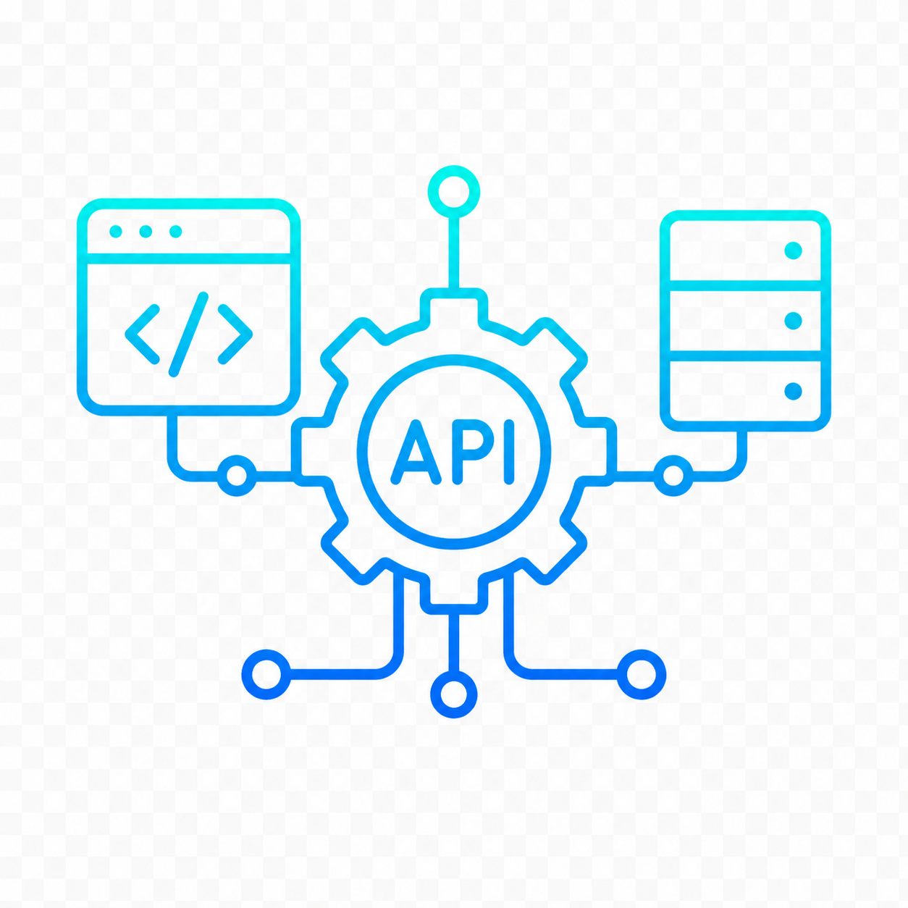

<section class="hero">
  

    
Data Engineer & Scientist · Problem Solver · Automation Enthusiast

    <h1>Transforming data into intelligent systems.</h1>

    

      I bridge the gap between complex data engineering and advanced analytics, building the automated pipelines, scalable infrastructure, and operational tools necessary to transform high-volume datasets into strategic, actionable clarity.
    

    

      <a class="button primary" href="./projects">View My Projects & Concepts →</a>
      <!-- <a class="button secondary" href="./articles">Read My Articles</a> -->
    

    

      <!-- Migrations -->
      

        

        <strong>5+</strong>
        Migration Projects Completed
      

      <!-- Education: Master's -->
      

        

        <strong>M.S.</strong>
        Data Science - Statistical Modeling and Analytics
      

      <!-- Scrubbing -->
      

        

        <strong>Millions</strong>
        Data Records Scrubbed, Validated, and Analyzed
      

      <!-- Experience -->
      

        

        <strong>8+</strong>
        Years Experience
      

    

      

  

    
    

      <strong>Meet Arthas</strong>
      Chief morale officer & expert in deadline supervision
    

  

</section>

<section class="expertise-grid">
  <article>
    

    <h3>Process Automation & Innovation</h3>
    
Engineering innovative, automated workflows that eliminate manual interventions, optimize operational efficiency, and scale data infrastructure for future growth.

  </article>

  <article>
    

    <h3>ETL & Pipeline Engineering</h3>
    
Architecting reliable, Python-powered pipelines and advanced SQL systems focused on secure, high-performance data communications.

  </article>

  <article>
    

    <h3>System Integration & Migration</h3>
    
Executing complex data migrations across enterprise platforms, including deep expertise with LMS, AMS, OMS, CRM, and ERP Solutions, ensuring structural integrity and automated synchronization.

  </article>

  <article>
    

    <h3>Data Quality & Statistical Modeling</h3>
    
Developing rigorous matching algorithms and validation frameworks to transform raw records into trustworthy, analytics-ready assets.

  </article>

  <article>
    

    <h3>Business Intelligence & Visualization</h3>
    
Designing impactful dashboards and visual analytics that translate complex datasets into clear, actionable insights for business strategy.

  </article>

  <article>
    

    <h3>API Architecture & Integration</h3>
    
Designing and implementing robust API integrations to connect disparate platforms, ensuring secure, high-speed data exchange and seamless system interoperability.

  </article>
</section>

<!--
<section class="articles-preview">
  

    
Latest Articles

    <h2>Research. Ideas. Insights.</h2>
    

      Thoughts on data engineering, automation, SQL, and the systems that power real business outcomes.
    

    <a class="button secondary" href="./articles">View All Articles →</a>
  

  

    

    
Data Engineering

    <h3>Designing Resilient ETL Pipelines That Scale</h3>
    
Key patterns for building pipelines that are reliable, observable, and easy to maintain.

    <small>May 12, 2026 · 6 min read</small>
  

  

    

    
SQL

    <h3>Upserts Done Right: Merge Patterns That Work</h3>
    
A practical guide to SQL Server merge patterns, pitfalls, and performance considerations.

    <small>Apr 28, 2026 · 8 min read</small>
  

  

    

    
Data Quality

    <h3>Measuring What Matters: Data Quality Metrics</h3>
    
The most important metrics to track when improving data quality and reducing risk.

    <small>Apr 15, 2026 · 5 min read</small>
  

</section>

-- Trigger github actions via deploy
-->

<section class="contact-cta">
  

    <h2>Let's build something great together.</h2>
    
I'm open to discussing new opportunities, interesting challenges, and data-heavy systems work.

  

  <a class="button primary" href="mailto:adosch93@gmail.com">Get In Touch →</a>
</section>
