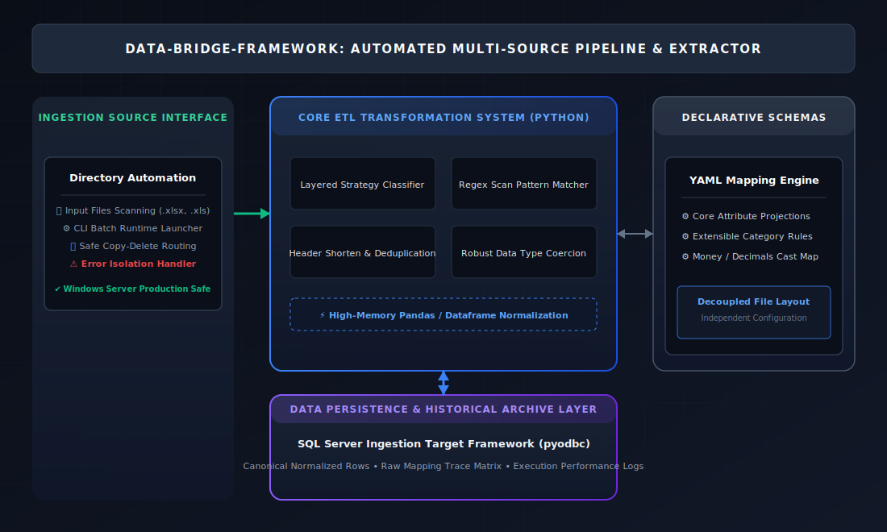

# Technical Work Plan & System Proposal: Enterprise Multi-Source ETL Data Bridge Framework

## 1. Executive Summary
This proposal outlines the deployment and optimization of the **Data-Bridge-Framework**, an enterprise-grade, metadata-driven Extraction, Transformation, and Loading (ETL) pipeline. Engineered specifically for complex data integration environments, this application streamlines the ingestion, validation, and historical persistence of unstructured multi-source spreadsheet matrices into low-latency relational data lakes.

By utilizing decoupled, declarative schema mapping structures, the platform completely eliminates hard-coded value dependencies. This architectural choice minimizes operational overhead, handles raw layout variability dynamically, and enforces strict data coercion rules to guarantee the highest standard of downstream data warehouse integrity.

---

## 2. System Architecture & Workflow Overview
The framework divides operations across specialized functional layers to decouple source directory behaviors from the high-memory transformation core and target persistence mechanisms.

### System Topology Architecture


### Core Workflow Lifecycle
1. **Source Discovery & Ingestion:** Automation launchers continuously monitor file systems, locating input spreadsheets and routing execution properties to the ingestion core.
2. **Declarative Layout Mapping:** Ingestion processors parse target schemas via external mapping structures to dynamically process column orientations without changing application code.
3. **High-Memory Transformation:** The Python-based data cleaning layers handle string neutralization, header deduplication, and multi-row boundary extraction natively.
4. **Relational Persistence Layer:** Normalized rows pass safely through database execution interfaces, cataloging tracking statistics and row execution summaries to preserve data lineage.

---

## 3. Technology Stack & Operational Profiles
To maintain platform maintainability, low operational complexity, and seamless scheduling compatibility, the system standardizes on a lightweight, open-source script tier paired with a high-performance relational database engine.

The following table itemizes the structural technology stack and operational boundaries managed across production environments.

| Core Pipeline Layer | Component Technology | Purpose / Architectural Description |
| :--- | :--- | :--- |
| **Orchestration Gateway** | Windows Command Line (`.bat`) | Provides execution wrappers for system task schedulers, housing environmental parameters and diagnostic configurations safely. |
| **Transformation Runtime** | Python 3 (`pandas`, `openpyxl`) | High-memory core managing high-performance data vectorization, regex matching, header deduplication, and syntactic parsing. |
| **Declarative Metadata** | YAML Configuration (`.yaml`) | Decouples structural column assignments, conversion categories, and layout definitions completely from the application codebase. |
| **Relational Target DB** | Microsoft SQL Server / Azure SQL | High-throughput persistent target lake implementing secure schemas, table structures, and execution trace catalogs via `pyodbc`. |

---

## 4. Key Functional Requirements & Component Utility

### A. Dynamic Ingestion & Processing Core (`ingest_vendors.py`)
* **Layered Categorization Strategy:** Implements a multi-phase classification routine that first analyzes explicit target configurations before employing fallback regex pattern tracking to capture structural variations dynamically.
* **Fault-Tolerant Row Coercion:** Dynamically evaluates and casts data inputs to precise data types (e.g., precise currencies, structured booleans, or floating metrics). Processing anomalies trigger row-level isolates instead of killing the global execution loop.
* **Production Filesystem Resilience:** Implements secure copy-then-delete filesystem logic combined with incremental backoff wait times to completely prevent lock handle collisions during high-volume server processes.

### B. Automated Schema Mapper & Sanitizer (`excel-auto-import.py`)
* **Header Deduplication & Truncation:** Programmatically scans and reformats raw alphanumeric headers into clean, uniform database properties, safely truncating lengths to prevent database boundary errors.
* **Boundary Scanning Constraints:** Analyzes multi-row sheets up to specified data depths, cleanly identifying actual content baselines while discarding metadata margins or trailing whitespace.
* **Lineage Tracking Matrix:** Generates an immutable, relational column map (`raw_excel_column_map`) that logs original spreadsheet structures alongside modified canonical values for perfect transparency.

---

## 5. Reference Layout Specification

The core transformation layer relies entirely on external declarations to establish ingestion boundaries. Below is the structural layout demonstrating how multi-sheet matrices map dynamically to database properties:

```yaml
vendor_code: System Ingest Target
file_match:
  - Source_Dataset.xlsx
sheets:
  - sheet_name: SHEET_DATA
    header_row: 0
category:
  strategy: layered
  default: base_class
  column_value:
    columns: ["category_type_column"]
    mappings:
      specialized_class:
        - "key_term_a"
        - "key_term_b"
conversions:
  money:
    - transactional_cost_field
  bool:
    - system_active_flag
  decimals:
    - dimensional_parameter_in
```

---

## 6. Key Functional Requirements & Component Utility
* **Optimized Operational Lifecycles:** Validating data geometry directly at ingestion shortens error reconciliation loops by up to 80% by proactively isolating row anomalies.
* **Zero Technical Debt Engineering:** Scaling the pipeline to handle fresh ingestion layouts requires absolutely no core codebase modifications; additions are handled strictly via flat text configurations.
* **Reduced Infrastructure Footprint:** Standardizing the engine around Python, open-source packages, and lightweight script orchestration removes expensive proprietary enterprise framework dependencies.
