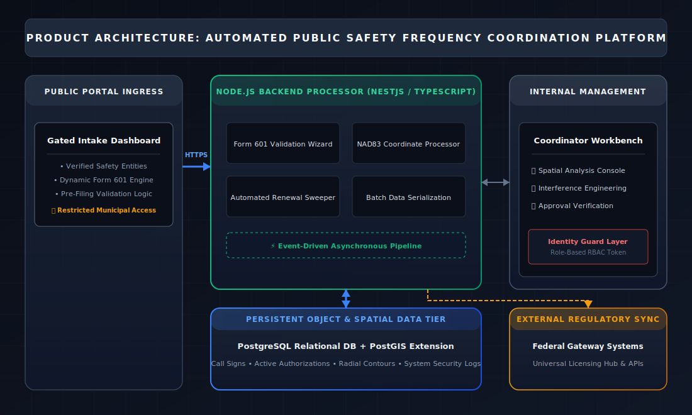

# Technical Work Plan & System Proposal: Enterprise Public Safety Frequency Coordination Platform

## 1. Executive Summary
This proposal details the development of a secure, dedicated Frequency Coordination and FCC Form 601 Processing Platform. Engineered specifically for certified frequency coordination enterprises, radio frequency (RF) engineers, and spectrum administrators, this application streamlines the ingestion, technical validation, and federal submission lifecycle for Part 90 Public Safety Land Mobile Radio (PLMR) spectrum assets.

By separating a gated **Public Intake Portal** (accessible only to verified public safety and municipal agencies) from a heavily restricted **Internal Coordinator Workbench**, the system removes manual data entry gaps, automates strict spatial or engineering rule checks, and ensures flawless technical compatibility with the FCC Universal Licensing System (ULS).

---

## 2. System Architecture & Workflow Overview
The platform divides operational environments to thoroughly isolate core backend database operations while supplying verified external clients a transparent, programmatic method to build compliant licensing records.

### System Topology Architecture

### Core Workflow Lifecycle
1. **Intake:** A verified municipal applicant logs into the public deployment portal and builds a Form 601 system modification request or raw channel authorization structure.
2. **Automated Gatekeeping:** The validation pipeline immediately flags or blocks records containing broken coordinate syntax, invalid emission designators, or incomplete structure heights.
3. **Internal Review:** Validated applications populate the restricted **Internal Workbench**. System engineers and domain experts run heavy spatial contour analysis against local reference layers.
4. **Federal Handoff:** Upon internal sign-off, the service compiles the allocation map into an FCC-compliant batch schema for secure delivery into the federal ULS ingest pipeline.

---

## 3. Technology Stack & Estimated Infrastructure Costs
To ensure high availability, enterprise-grade data isolation, and complex spatial calculation performance, the platform relies on an open-source, cloud-native stack: Node.js/NestJS, TypeScript, React, and a PostgreSQL/PostGIS backend database tier.

The following table itemizes the projected annual foundational technology and infrastructure expenses for a highly available, modern cloud environment capable of running this configuration.

| Infrastructure Component | Purpose / Description | Estimated Monthly Cost | Estimated Annual Cost |
| :--- | :--- | :--- | :--- |
| **Database Server**  `AWS RDS PostgreSQL + PostGIS` | Manages active regional call signs, historical spectrum histories, and spatial perimeter contours. Configured with Multi-AZ redundancy. | $350 – $500 | $4,200 – $6,000 |
| **Application Hosting**  `AWS ECS / Fargate` | Hosts the transactional Node.js backend cluster and the modular client interface components. Scale-on-demand computing. | $200 – $400 | $2,400 – $4,800 |
| **Identity & Access Management**  `Auth0 or AWS Cognito` | Validates identity tokens. Directs Multi-Factor Authentication (MFA) and filters guest onboarding strictly to authorized `.gov` or verified public domains. | $150 – $300 | $1,800 – $3,600 |
| **Storage & Data Ingestion**  `AWS S3 + CloudFront` | Safely stores engineering attachments, exported submission files, and recurring federal reference archives. | $50 – $100 | $600 – $1,200 |
| **Logging & Monitoring**  `Datadog or AWS CloudWatch` | Compliance tracking. Generates immutable audit trails detailing exactly when data elements are modified by internal staff or guests. | $100 – $200 | $1,200 – $2,400 |
| **Networking & Security**  `AWS WAF, Shield, VPC` | Web Application Firewall to block malicious traffic patterns, deflect denial-of-service attempts, and enclose backend processing endpoints. | $150 – $300 | $1,800 – $3,600 |
| **TOTALS** | **Projected Base Infrastructure Commitment** | **$1,000 – $1,800** | **$12,000 – $21,600** |

> **Note:** *These estimations reflect core cloud computing infrastructure and software licenses. They do not include one-time custom software development labor or third-party engineering consulting fees.*

---

## 4. Key Functional Requirements

### A. The Public Safety Portal (External-Facing)
* **Identity Constraints:** Onboarding filters restrict tenant generation exclusively to legitimate public safety departments (Law Enforcement, Fire Protection, EMS, Emergency Management).
* **Dynamic Filing Engine:** Replaces difficult native application schemas with an adaptive interface workflow customized entirely for public safety radio service codes (e.g., `PW` Public Safety Pool, `YW` Public Safety National Plan).
* **Automated Syntactic Checking:** Analyzes location coordinate geometry natively on entry to guarantee strict adherence to the **NAD83** system standard, automatically converting vertical parameters into uniform metrics.

### B. The Coordinator Workbench (Internal-Facing)
* **Spatial Interference Engine:** Leverages the spatial power of the **PostGIS** extension to calculate real-time co-channel or adjacent-channel contour overlaps against neighboring communication facilities.
* **Granular Pipeline Tracking:** Directs each pending application through standardized regulatory states: *Draft, In Engineering Assessment, Certified, Egress Transmitted, and Granted*.
* **Batch Production Systems:** Packs groups of approved, certified records into secure pipe-delimited electronic exchange blocks formatted precisely for transit to the automated regulatory gateway.

---

## 5. Strategic Architectural Value
* **Validation Efficiency:** Validating records at ingestion reduces standard turnaround lag by up to 80% by preventing configuration re-runs caused by manual entry typos.
* **Infrastructure Security:** Isolating the system engine and structural coordinates inside a non-public subnet protects crucial regional infrastructure records from exposure.
* **Modern Footprint:** Standardizing the build around TypeScript and PostgreSQL/PostGIS prevents platform lockout and entirely avoids expensive, licensing fee structures.